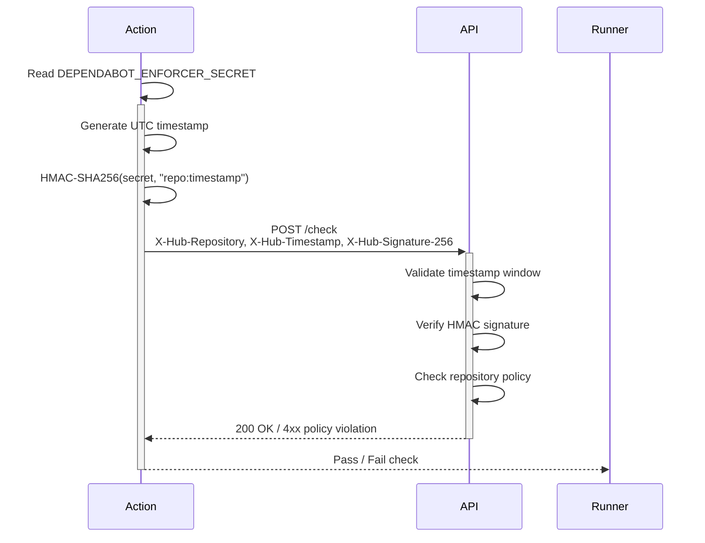

# Dependabot Policy Enforcer Action

<!-- vale off -->
[](https://github.com/nhs-england-tools/dependabot-policy-enforcer-action/actions/workflows/cicd-1-pull-request.yaml)
[](https://sonarcloud.io/summary/new_code?id=dependabot-policy-enforcer-action)
<!-- vale on -->

A reusable GitHub Action that runs as a required workflow check. It generates a signed request using HMAC-SHA256 and calls the Dependabot Policy Enforcer API to validate that a repository meets Dependabot policy requirements.

This action:

1. Reads the repository shared secret from a repository secret (`DEPENDABOT_ENFORCER_SECRET`)
2. Generates an HMAC-SHA256 signature from the repository name and a UTC timestamp
3. Sends a signed `POST` request to the configured policy enforcer API endpoint
4. Fails the check with a clear message if the policy is not met, the secret is missing, or configuration is malformed

## Table of Contents

- [Dependabot Policy Enforcer Action](#dependabot-policy-enforcer-action)
  - [Table of Contents](#table-of-contents)
  - [Setup](#setup)
    - [Prerequisites](#prerequisites)
    - [Configuration](#configuration)
  - [Usage](#usage)
    - [Inputs](#inputs)
    - [Outputs](#outputs)
    - [Testing](#testing)
  - [Design](#design)
    - [Diagrams](#diagrams)
    - [Modularity](#modularity)
  - [Contributing](#contributing)
  - [Contacts](#contacts)
  - [Licence](#licence)

## Setup

Clone the repository

```shell
git clone https://github.com/nhs-england-tools/dependabot-policy-enforcer-action.git
cd nhs-england-tools/dependabot-policy-enforcer-action
```

### Prerequisites

The following software packages, or their equivalents, are expected to be installed and configured:

- [Node.js](https://nodejs.org/) 24 or later,
- [Yarn](https://yarnpkg.com/) 4.x — enable via `corepack enable`.

### Configuration

Install dependencies

```shell
yarn install
```

Each repository that uses this action also needs a shared secret registered with the Dependabot Policy Enforcer service. Contact your platform team to have a secret provisioned, then store it as a repository secret:

1. Go to **Settings → Secrets and variables → Actions** in your repository.
2. Click **New repository secret**.
3. Name: `DEPENDABOT_ENFORCER_SECRET`
4. Value: the secret provided by your platform team.

To avoid hardcoding environment-specific values, use the following storage approach:

| Value | Recommended storage |
|-------|---------------------|
| API endpoint URL | Organisation variable: `DEPENDABOT_ENFORCER_API_ENDPOINT` |
| Shared HMAC secret | Repository secret: `DEPENDABOT_ENFORCER_SECRET` |

Organisation variables are accessible to all repositories in the organisation without duplication.

## Usage

Add the action to a workflow in your repository:

```yaml
name: Dependabot Policy Check

on:
  push:
  pull_request:

jobs:
  dependabot-policy:
    runs-on: ubuntu-latest
    steps:
      - uses: nhs-england-tools/dependabot-policy-enforcer-action@v1
        with:
          api-endpoint: ${{ vars.DEPENDABOT_ENFORCER_API_ENDPOINT }}
          secret: ${{ secrets.DEPENDABOT_ENFORCER_SECRET }}
```

### Inputs

| Input | Required | Default | Description |
|-------|----------|---------|-------------|
| `api-endpoint` | Yes | — | Full URL of the Dependabot Policy Enforcer API endpoint. Set this as an organisation or repository variable (`vars.DEPENDABOT_ENFORCER_API_ENDPOINT`). |
| `secret` | Yes | — | Shared HMAC secret for this repository. Must be stored as a repository secret (`secrets.DEPENDABOT_ENFORCER_SECRET`). **Never hardcode this value.** |
| `timeout-ms` | No | `10000` | Request timeout in milliseconds. |

### Outputs

| Output | Description |
|--------|-------------|
| `status-code` | The HTTP status code returned by the API. |
| `response-body` | The response body from the API (sensitive fields are redacted). |

### Testing

Run the test suite:

```shell
yarn test --run
```

Run with coverage:

```shell
yarn test --run --coverage
```

A helper script is included at `scripts/hmac-helper.ts` to assist with local testing and signature verification. The core functions (`hmacHex`, `generateSignature`, `verifySignature`) are the reference implementation of the signing algorithm, providing a vetted starting point and enabling debugging of signature failures before raising a pull request:

```shell
# Generate headers for a test request
yarn hmac-helper generate \
  --repo my-org/my-repo \
  --secret <your-secret>

# Verify an existing signature
yarn hmac-helper verify \
  --repo my-org/my-repo \
  --secret <your-secret> \
  --timestamp 2026-03-03T12:00:00.000Z \
  --signature sha256=<hex>

# Send a real request (for integration testing in dev)
yarn hmac-helper request \
  --repo my-org/my-repo \
  --secret <your-secret> \
  --endpoint $DEPENDABOT_ENFORCER_API_ENDPOINT
```

## Design

### Diagrams

Each request is signed using HMAC-SHA256. The signing payload combines the repository name and a UTC timestamp, which is verified server-side against the stored secret. The timestamp must be in ISO 8601 UTC format with milliseconds zeroed (`.000Z` suffix), and the hex digest is prefixed with `sha256=`.



Every request includes the following signed headers:

| Header | Example value | Description |
|--------|---------------|-------------|
| `X-Hub-Repository` | `my-org/my-repo` | The full repository name in `owner/repo` format. Derived automatically from `github.repository`. |
| `X-Hub-Timestamp` | `2026-03-03T12:00:00.000Z` | UTC timestamp used in signature generation. |
| `X-Hub-Signature-256` | `sha256=a1b2c3...` | HMAC-SHA256 hex digest, prefixed with `sha256=`. |

### Modularity

The action is configurable via inputs (see [Inputs](#inputs)) and enforces the following authentication rules server-side. The action will fail with a descriptive message if any check does not pass:

| Rule | Window / Constraint | Error if violated |
|------|---------------------|-------------------|
| Timestamp must be valid ISO 8601 UTC | — | `INVALID_TIMESTAMP` |
| Timestamp must not be older than 5 minutes | 300 000 ms | `TIMESTAMP_EXPIRED` |
| Timestamp must not be more than 30 seconds in the future | 30 000 ms | `TIMESTAMP_FUTURE` |
| Repository organisation must be in the allowlist | — | `FORBIDDEN_REPO` |
| HMAC signature must match | — | `SIGNATURE_MISMATCH` |
| Repository secret must exist | — | `SECRET_NOT_FOUND` |

Error handling behaviour:

| Scenario | Behaviour |
|----------|-----------|
| `DEPENDABOT_ENFORCER_SECRET` is missing or empty | Action fails immediately with a clear error message before any network call is made. |
| `api-endpoint` is missing or malformed | Action fails immediately with a clear error message. |
| Non-2xx response from API | Action fails and logs the status code and (redacted) response body. The secret is never included in logs. |
| Request timeout | Action fails with a timeout error after the configured `timeout-ms`. |
| `TIMESTAMP_EXPIRED` | Indicates the runner clock is significantly behind. Check runner time synchronisation. |

Security considerations:

- The shared secret is **never** written to logs, workflow summaries, or outputs.
- The action uses `core.setSecret()` to mask the secret value in all log output.
- Replay attacks are prevented by the 5-minute timestamp window enforced by the authoriser.
- The repository name is validated against an organisation allowlist server-side.

## Contributing

Raise an issue or open a pull request against this repository. Please ensure:

- Code changes are covered by tests (`yarn test --run`)
- Commits follow the repository conventions
- Any changes to the signing algorithm are made in `src/lib/signing.ts` (the single source of truth) and covered by tests in `src/__tests__/signing.test.ts`

## Contacts

Raise a [GitHub issue](https://github.com/nhs-england-tools/dependabot-policy-enforcer-action/issues) or contact the NHS England Tools platform team.

## Licence

Unless stated otherwise, the codebase is released under the MIT License. This covers both the codebase and any sample code in the documentation.

Any HTML or Markdown documentation is [© Crown Copyright](https://www.nationalarchives.gov.uk/information-management/re-using-public-sector-information/uk-government-licensing-framework/crown-copyright/) and available under the terms of the [Open Government Licence v3.0](https://www.nationalarchives.gov.uk/doc/open-government-licence/version/3/).
